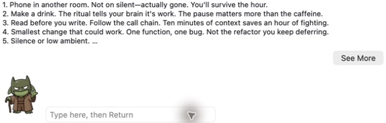
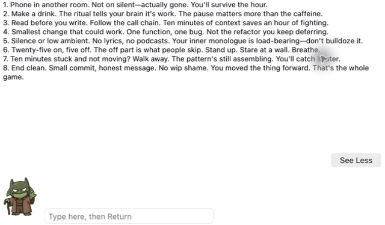

# CG-Agent-MacOS-Avatar

A walking menu-bar companion for **Apple Silicon macOS 13+**, written in Rust.
Click the creature, type a message, and press Return. Replies appear above it;
**See More** opens a scrollable plain-text pane.

Avatar starts in **Direct Ollama** mode. It can also chat through a local
[CG-Agent-Harness](https://github.com/cgfixit/CG-Agent-Harness). The app is a
client: it sends chat requests, displays replies, and keeps its own network
connections on loopback.



*Classic theme, live Direct Ollama reply. Captured from the native app on
September 21, 2026; [capture details](docs/screenshots/README.md).*

## Get started

Build from this repository with Rust installed through rustup:

```sh
./scripts/ci.sh
./scripts/package-app.sh
open dist/CG-Agent-MacOS-Avatar.app
```

The repository selects Rust 1.88. The resulting app is ad-hoc signed and **not
notarized**. See [Build and verification](docs/BUILD.md) for prerequisites,
toolchain setup, dependency checks, and package validation.

For a downloadable build, merges to `main` produce an Actions → **bundle**
artifact named `CG-Agent-MacOS-Avatar.zip` with 14-day retention. The same workflow
publishes prereleases at noon America/New_York when there are new commits, or
on manual dispatch. [Releases](https://github.com/cgfixit/CG-Agent-Avatar/releases)
are also ad-hoc signed, not notarized; macOS may require **Open Anyway**.

## Choose a backend

| Backend | Setup and behavior |
|---|---|
| **Direct Ollama (default)** | Start a local service on `http://127.0.0.1:11434` that exposes `/api/tags` and `/v1/chat/completions` and serves `qwen3.8:27b-mlx`. Avatar sends the bundled [Soul prompt](resources/direct-ollama-system.md) and the current message. It does not start Ollama, install a model, or send previous turns. Optional [web lookups](#web-lookups-direct-ollama) run only when you ask for one. |
| **Harness** | Select **Harness (127.0.0.1:8790)** in the menu. Avatar launches or activates the installed Harness desktop app, then discovers its listener. A headless `cgagentharness serve` instance also works. TLS and account setup are described below. |

The Ollama model tag is fixed in this version. A responding local service alone
does not guarantee that it can serve that model. Harness manages its own model
and conversation session; Avatar reuses a session titled `CG-Agent`, or creates one when none has that title.

### Web lookups (Direct Ollama)

To use the web, ask in plain words:

- "search the web for best pizza in Atlanta", "look up …", or "google …"
- "read https://…", or "summarize https://…"

Avatar then asks the local Ollama service to run that one search (up to five
results) or to read that one page. It passes the text to the model as untrusted
reference material, and the reply ends with `[via web ×1]`. Any other message
stays a local chat. Starting a message with just `search …` does not trigger a
lookup. The full phrase list is in [Controls](docs/CONTROLS.md#web-lookups-direct-ollama).

Lookups need Ollama 0.18.1 or newer, signed in with `ollama signin`, with its
cloud features enabled. Ollama runs the lookup through its cloud service under
your Ollama account, so the query or link leaves your Mac. Avatar itself still
connects only to `127.0.0.1` and holds no API key. Links to private hosts are
refused: `localhost`, private or link-local IPs, `.local` names, single-word
hosts, and links with embedded passwords.

## Talk and read replies

Click the creature or choose **Talk** from its menu-bar menu. Typing works even
when a backend is unavailable. Return sends the message; `…thinking` remains
visible until the non-streaming request completes.



**See More** expands the reply; **See Less** restores the compact bubble. Both
backends share this renderer. The Classic bubble is 640×112 points; the expanded
pane grows up to 420 points and scrolls for longer replies. Preview text is
limited to 400 characters and expanded text to 8,000, with an ellipsis at the
limit. Messages accept up to 32,768 characters after trimming; this is an input
limit, not a model token-context guarantee.

The transparent overlay follows the creature. Empty space passes clicks through
to the app underneath. The default Classic theme uses dark text on a translucent
white background; an optional Fable Protocol theme uses warm text on a dark
background. See [Controls and themes](docs/CONTROLS.md) for the menu, launch
setting, and troubleshooting messages.

## Harness TLS and login

Avatar reads the selected Harness home's port and leaf certificate. The default
home is `~/.CGagentHarness`; `CGAGENTHARNESS_HOME` may select another absolute path
without `..` components. It never reads the home's `.env` file.

For a TLS-enabled home, Avatar pins `tls/server.pem` for its HTTPS connection.
It does not change Keychain trust or disable certificate validation. Keep Avatar
and Harness pointed at the same home. Legacy HTTP homes remain supported.

For an account-gated home:

1. Select **Harness (127.0.0.1:8790)**. Login by itself does not change the backend.
2. Choose **Harness Login…**, enter the account configured in Harness, and wait
   for the result in the bubble.
3. If Harness requires a bootstrap password replacement, choose **Harness
   Password Reset…**. Enter the current password and a new password of at least
   12 characters. **OK** in the new-password prompt submits the change;
   **Cancel** leaves it unchanged. Wait for `password changed — ready to chat`.

Password Reset changes only the authenticated account and requires its current
password; it is not forgotten-password recovery. Credentials and cookies stay
in memory, so log in again after restarting Avatar. Guarded requests obtain the
console CSRF token after login and password changes.

### Harness port

Headless serving normally uses port **8790**, or the port in `harness.json`.
The desktop app's sidecar uses an ephemeral port. Avatar probes the configured
port, then finds candidate Harness listeners using argv-only `lsof` and validates
`GET /api/status`. It does not scan the port range or use the desktop focus
socket. Do not run desktop and headless Harness instances against the same home.

### Harness launch

Selecting Harness asks macOS Launch Services to resolve and open bundle ID
`com.cgfixit.agent-harness`. An existing instance is activated; an unregistered
app produces a message suggesting installation or headless serving. Avatar does
not spawn `cgagentharness serve`, pass command arguments, or hardcode an install
path.

## Network and capability boundaries

- Avatar connects only to literal IPv4/IPv6 loopback addresses (`127.0.0.1` and
  `::1`); it rejects `localhost` names and HTTP redirects.
- Direct Ollama chat requests contain the system prompt and the current message,
  with no tool definitions, API keys, or agent jobs. When you explicitly ask for
  a web lookup, the message also carries that one lookup's results. The lookup
  goes through the local Ollama service's experimental web routes; Avatar never
  contacts a web host itself.
- Harness chat may use capabilities configured in Harness itself. Avatar only
  displays a `[via web ×N]` note when the reply reports web-tool use; it never
  fetches those pages. A local Avatar connection does not imply that the
  configured Harness provider or tools operate offline.
- Replies render as plain text. Avatar does not execute HTML or open reply URLs.

See [SECURITY.md](SECURITY.md) for route allowlists, TLS trust, response limits,
credential handling, and residual risks.

## Contributing with coding agents

[AGENTS.md](AGENTS.md) is the shared contract for human and agent contributors. It
covers the architecture, hard security rules, contract tests, and the doc each
fact belongs in. Claude Code reads it through [CLAUDE.md](CLAUDE.md), and Codex
reads it directly. Repo skills in `.claude/skills/` (also exposed to Codex as
`.agents/skills/`) include three manual commands:

| Claude Code | Codex | Does |
|---|---|---|
| `/pr-opportunity-scan [focus]` | `$pr-opportunity-scan` | ~3-minute read-only scan that proposes 3-4 focused PRs |
| `/ollama-doctor [symptom]` | `$ollama-doctor` | Direct Ollama model, prompt, and symptom diagnosis |
| `/docs-sync [scope] [--check]` | `$docs-sync` | Rewrites stale docs to match the current source |

## Documentation

- [Agent contributor guide](AGENTS.md)
- [Build and verification](docs/BUILD.md)
- [Controls, themes, and troubleshooting](docs/CONTROLS.md)
- [Screenshot provenance and native verification](docs/screenshots/README.md)
- [Security model](SECURITY.md)

MIT licensed. See [LICENSE](LICENSE).
