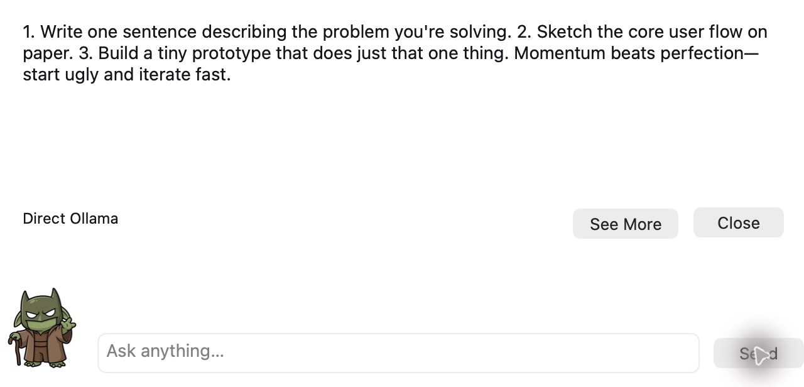
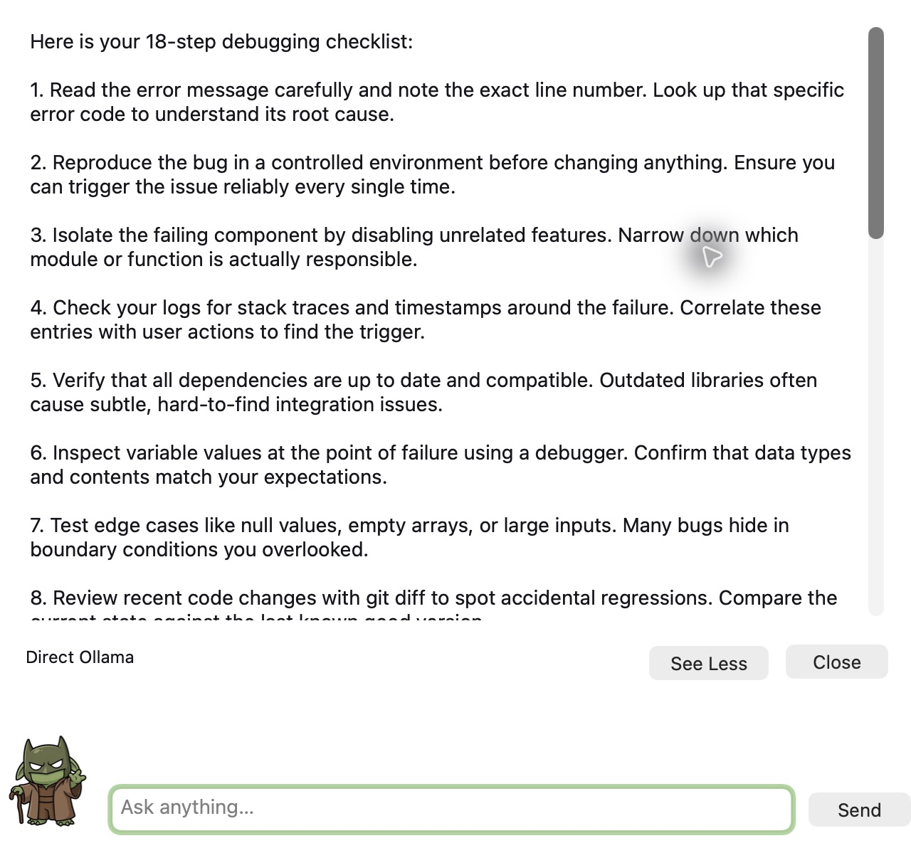

# CG-Agent-MacOS-Avatar

A walking menu-bar companion for **Apple Silicon macOS 13+**, written in Rust.
Click the creature, type a message, and press Return. Replies appear above it;
**See More** opens a scrollable plain-text pane.

Avatar starts in **Direct Ollama** mode. It can also chat through a local
[CG-Agent-Harness](https://github.com/cgfixit/CG-Agent-Harness). The app is a
client: it sends chat requests, displays replies, and keeps its own network
connections on loopback.



*Classic theme with a live Direct Ollama reply, captured from the packaged
macOS app in September 2026. [Capture details](docs/screenshots/README.md).*

## Get started

Build from this repository with Rust installed through rustup:

```sh
./scripts/ci.sh
./scripts/package-app.sh
open dist/CG-Agent-MacOS-Avatar.app
```

The repository selects Rust 1.88. The resulting app is ad-hoc signed and **not
notarized**. See [Build and verification](docs/BUILD.md) for prerequisites,
toolchain setup, dependency checks, and package validation.

For a downloadable build, merges to `main` produce an Actions → **bundle**
artifact named `CG-Agent-MacOS-Avatar.zip` with 14-day retention. The same workflow
publishes a prerelease at noon America/New_York when there are new commits. A
manual run from `main` publishes a full release marked Latest unless that option
is unchecked on the dispatch form; from any other branch it stays a prerelease.
[Releases](https://github.com/cgfixit/CG-Agent-Avatar/releases) are also ad-hoc
signed, not notarized; macOS may require **Open Anyway**.

## Choose a backend

| Backend | Setup and behavior |
|---|---|
| **Direct Ollama (default)** | Start a local service on `http://127.0.0.1:11434` that exposes `/api/tags` and `/v1/chat/completions` and serves `qwen3.8:27b-mlx`, which needs Ollama v0.32.12 or newer (the release that added Qwen 3.8 27B) and, per Ollama's own macOS requirements, macOS 14 or newer. Avatar sends the bundled [Soul prompt](resources/direct-ollama-system.md) and the current message, and asks for a direct answer without a hidden reasoning pass. It does not start Ollama, install a model, or send previous turns. Optional [web lookups](#web-lookups-direct-ollama) run only when you ask for one. |
| **Harness** | Select **Harness (127.0.0.1:8790)** in the menu. Avatar launches or activates the installed Harness desktop app, then discovers its listener. A headless `cgagentharness serve` instance also works. TLS and account setup are described below. |

The Ollama model tag is fixed, and a responding local service alone does not
guarantee that it can serve that model. Harness manages its own model and
conversation session; Avatar reuses a session titled `CG-Agent`, or creates one.

### Web lookups (Direct Ollama)

To use the web, ask in plain words:

- "search the web for best pizza in Atlanta", "look up …", or "google …"
- "read https://…", or "summarize https://…"

Avatar then asks the local Ollama service to run that one search (up to five
results) or read that one page, passes the text to the model as untrusted
reference material, and ends the reply with `[via web ×1]`. Any other message
stays a local chat; a bare `search …` does not trigger a lookup. The full phrase
list is in [Controls](docs/CONTROLS.md#web-lookups-direct-ollama).

Lookups need Ollama 0.18.1 or newer, signed in with `ollama signin`, with its
cloud features enabled. Ollama runs the lookup through its cloud service under
your Ollama account, so the query or link leaves your Mac. Avatar itself still
connects only to `127.0.0.1` and holds no API key. Links to private hosts
(`localhost`, private or link-local IPs, `.local` names, single-word hosts) and
links with embedded passwords are refused.

## Talk and read replies

Click the creature or choose **Talk** from its menu-bar menu. Typing works even
when a backend is unavailable. Return sends the message, and `…thinking` stays
until the non-streaming request completes.



**See More** expands the reply; **See Less** restores the compact bubble. Both
backends share this renderer. Preview text is limited to 400 characters and
expanded text to 8,000, with an ellipsis at the limit. Messages accept up to
32,768 characters after trimming; this is an input limit, not a model
token-context guarantee.

The transparent overlay follows the creature, and empty space passes clicks
through to the app underneath. The default Classic theme uses dark text on a
translucent white background; the optional Fable Protocol theme uses warm text on
a dark background. [Controls and themes](docs/CONTROLS.md) covers the menu,
bubble sizes, launch setting, and troubleshooting messages.

## Harness TLS and login

Avatar reads the selected Harness home's port and leaf certificate. The default
home is `~/.CGagentHarness`; `CGAGENTHARNESS_HOME` may select another absolute path
without `..` components. It never reads the home's `.env` file.

For a TLS-enabled home, Avatar pins `tls/server.pem` for its HTTPS connection.
It does not change Keychain trust or disable certificate validation. Keep Avatar
and Harness pointed at the same home. Legacy HTTP homes (no `tls/server.pem`)
remain supported; a home with that file never falls back to plain HTTP.

For an account-gated home:

1. Select **Harness (127.0.0.1:8790)**. Avatar opens the installed Harness app
   and waits for a confirmed loopback status response. The bubble then guides
   the next step. Login by itself does not change the backend.
2. When the bubble asks you to log in, choose **Harness Login…** and enter the
   account configured in Harness. Wait for the result in the bubble.
3. If Harness requires a bootstrap password replacement, choose **Harness
   Password Reset…**. Enter the current password and a new password of at least
   12 characters. **OK** in the new-password prompt submits the change;
   **Cancel** leaves it unchanged. Avatar checks Harness status again after the
   change and enables chat only when the model, provider, and key are usable.

If the bubble asks you to configure a model, provider, or key, do that in
Harness and wait for Avatar's next status check. Text typed before Harness is
ready stays in the field. Password Reset changes only the authenticated account
and is not forgotten-password recovery. Credentials and cookies stay in memory,
so log in again after restarting Avatar.

### Harness port and launch

Headless serving normally uses port **8790**, or the port in `harness.json`;
the desktop app's sidecar uses an ephemeral port. Avatar probes the configured
port, then finds candidate Harness listeners with argv-only `lsof` and validates
`GET /api/status`. It never scans the port range or uses the desktop focus
socket. Do not run desktop and headless Harness instances against the same home.

Selecting Harness asks Launch Services to open bundle ID
`com.cgfixit.agent-harness`; an existing instance is activated, and an
unregistered app produces a message suggesting installation or headless serving.
Avatar never spawns `cgagentharness serve`, passes arguments, or hardcodes an
install path.

## Network and capability boundaries

- Avatar connects only to literal loopback addresses (`127.0.0.1` and `::1`),
  rejecting `localhost` names and HTTP redirects.
- Direct Ollama requests carry the system prompt and the current message, with no
  tool definitions, API keys, or agent jobs. An explicit web lookup adds that one
  lookup's results, fetched by the local Ollama service; Avatar never contacts a
  web host itself.
- Harness chat may use capabilities configured in Harness. Avatar only shows a
  `[via web ×N]` note when the reply reports web-tool use; a local Avatar
  connection does not imply that the Harness provider or tools operate offline.
- Replies render as plain text. Avatar never executes HTML or opens reply URLs.

[SECURITY.md](SECURITY.md) holds the route allowlists, TLS trust, response
limits, credential handling, and residual risks.

## Contributing with coding agents

[AGENTS.md](AGENTS.md) is the shared contract for human and agent contributors:
architecture, hard security rules, contract tests, the doc each fact belongs in,
and the repo skills in `.claude/skills/`. Claude Code reads it through
[CLAUDE.md](CLAUDE.md); Codex reads it directly.

## Documentation

- [Agent contributor guide](AGENTS.md)
- [Build and verification](docs/BUILD.md)
- [Controls, themes, and troubleshooting](docs/CONTROLS.md)
- [Screenshot provenance and native verification](docs/screenshots/README.md)
- [Security model](SECURITY.md)

MIT licensed. See [LICENSE](LICENSE).
